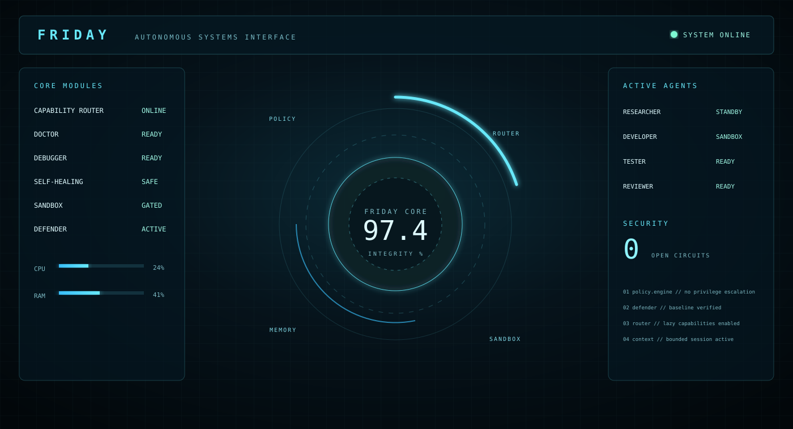

# FRIDAY // Autonomous Systems Interface

[](https://github.com/LucasFrancoNs/Friday-AI-Showcase/actions/workflows/tests.yml)


> A local-first experimental AI agent architecture focused on modular capabilities, deterministic diagnostics, sandboxed code workflows, security boundaries and long-session resilience.

<p align="center">
  
</p>

**Friday-AI-Showcase** is the public, sanitized portfolio edition of my personal Friday AI project. It intentionally excludes credentials, personal memory, character/Live2D assets, private account integrations, and the full device-control runtime.

The public interface uses an **original holographic systems HUD** inspired by general science-fiction UI language. It is not affiliated with, endorsed by, or a reproduction of Marvel/JARVIS.

## What Friday demonstrates

```text
User Goal
   |
Capability Router
   |
Policy / Provenance Gate
   |
+----------------------+----------------------+-------------------+
|                      |                      |                   |
Doctor / Debugger   Dynamic Agents        Self-Healing        Sandbox
|                      |                      |                   |
+----------------------+----------+-----------+-------------------+
                                  |
                              Reviewer
                                  |
                           Explicit Promotion
```

The central idea is simple: **be large in capability, but small during each task**.

Instead of exposing every integration and tool to a model, Friday routes the request first, loads only the relevant capability bundle, enforces policy, and prefers deterministic systems before escalating to an LLM.

## Holographic HUD

Open `index.html` locally to run the zero-dependency browser demo:

```bash
git clone https://github.com/LucasFrancoNs/Friday-AI-Showcase.git
cd Friday-AI-Showcase
```

Then open `index.html` in a browser.

The HUD currently visualizes Core status, Capability Router, Doctor, Debugger, Self-Healing, Sandbox, Defender, active agent roles, circuit status and synthetic resource telemetry.

A GitHub Pages workflow is already prepared in `.github/workflows/pages.yml`. Once Pages is enabled for this repository, the HUD can be published as a live web demo.

## Public demo modules

| Module | Demonstrates |
|---|---|
| `friday_open/capability_router.py` | deterministic small-bundle routing |
| `friday_open/doctor.py` | local Python structural checks |
| `friday_open/context_manager.py` | bounded deterministic session compaction |
| `friday_open/web_repair.py` | conservative high-confidence HTML repair |
| `index.html` + `styles.css` | original holographic Friday HUD |

These are intentionally smaller public implementations. The private Friday repository contains the broader experimental runtime.

## Engineering principles

**Deterministic first.** Common structural errors, context management, routing and many safety checks should not require an LLM.

**Local first.** Sensitive workflows can prefer local inference instead of automatically escalating to a cloud model.

**Capability routing + lazy loading.** Friday should not load or expose its whole feature set for every request.

**Data is not authorization.** A webpage, document, email or screen can provide information, but it cannot grant itself permission to execute a risky action.

**Sandbox-first coding.** AI-generated code belongs in staging before it reaches the real project.

**Fixed permission profiles for dynamic roles.** Agents may be created dynamically, but their privileges come from a versioned registry.

**Measured resilience.** Defender, Performance Guard, circuit breakers and Chaos tests exist so growth is measured rather than guessed.

## Tests

```bash
python -m pip install -r requirements-dev.txt
python -m pytest -q
```

The browser HUD itself has no package dependencies.

## Public / private boundary

This repository does **not** publish API keys, `.env`/ `key.env`, cookies, authentication material, personal memory, conversation history, logs, checkpoints, private account integrations, personal device configuration or Live2D character assets.

See [SECURITY.md](SECURITY.md) and [docs/SECURITY.md](docs/SECURITY.md) for the public security boundary.

## Project evolution

The private Friday project has evolved through Doctor/Debugger, Policy Engine, autonomous loops, Capability Routing, Dynamic Agent Teams, Self-Healing, Prompt Injection Defense, Sandbox Gate, Strategic Autonomy, Defender/Performance Guard, Chaos Evaluation and Context Resilience.

This repository presents the architecture as a **clean portfolio showcase** rather than publishing every private implementation detail.

## Documentation

- [Architecture](docs/ARCHITECTURE.md)
- [Security model](docs/SECURITY.md)
- [Public roadmap](docs/ROADMAP.md)
- [Contributing](CONTRIBUTING.md)
- [License](LICENSE.md)

## Author

Built by **Lucas Franco** as a long-term personal AI / agent engineering project.
